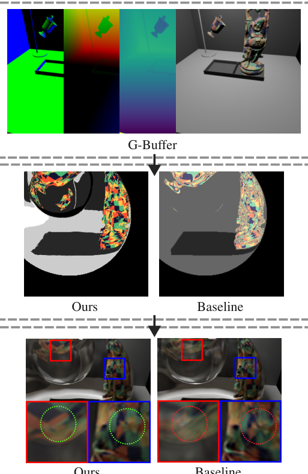
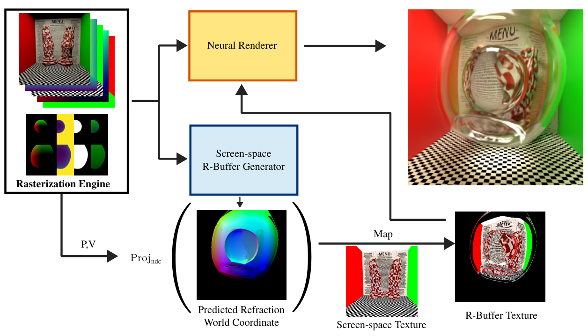
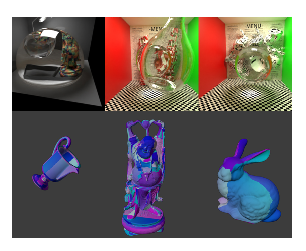
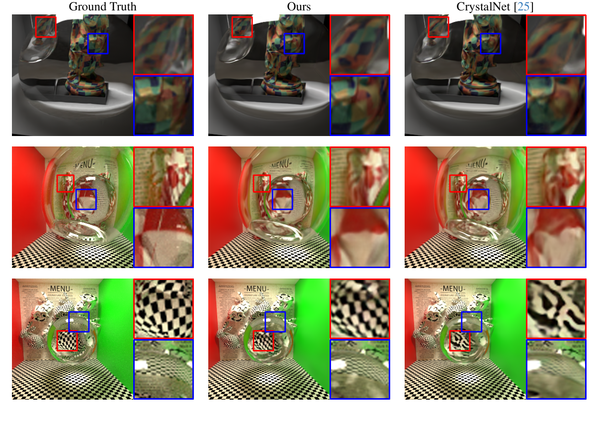
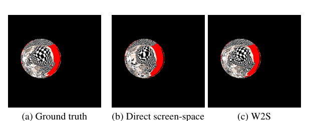

# G 缓冲区支持的神经屏幕空间折射烘焙，用于实时全局光照

**G-Buffer Supported Neural Screen-space Refraction Baking for Real-Time Global Illumination**

**作者：** 张子扬（Ziyang Zhang）、Edgar Simo-Serra

**单位：** 早稻田大学（Waseda University），东京，日本

**邮箱：** ziyangz5@toki.waseda.jp，ess@waseda.jp

---

## 摘要（Abstract）

我们提出了一种用于全局光照渲染的**神经屏幕空间折射烘焙**方法，可应用于实时 3D 游戏。现有的神经全局光照渲染方法在处理折射物体时常常遇到困难，原因是 G 缓冲区（G-Buffer）中缺乏纹理信息。虽然一些现有方法通过预测纹理贴图（UV 图）将神经全局光照扩展到折射物体，但它们仅限于具有简单几何形状和 UV 贴图的物体。相比之下，我们的方法**无需这些假设**即可烘焙折射纹理：它直接将折射物体的**世界坐标**编码到神经网络中，而非 UV 坐标。我们的实验表明，在折射渲染方面，我们的方法优于先前的方法。此外，我们还研究了在不同空间（如世界空间、屏幕空间和 UV 空间）中烘焙坐标时神经网络的性能差异，结果表明在世界空间坐标中烘焙可获得最佳效果。

---

## 1. 引言（Introduction）

全局光照渲染是计算机图形学中的一个基本问题，在从 3D 场景生成逼真图像方面发挥着基础性作用。虽然离线全局光照可以通过昂贵的路径追踪算法 [14] 很好地实现，但**实时全局光照**仍然是一个具有挑战性的问题，对实时 3D 游戏至关重要。传统上，预计算（即"烘焙"）全局光照是实现实时全局光照渲染的常见做法。近年来，使用神经网络来烘焙全局光照，将传统预计算方法的能力扩展到了处理动态场景和复杂光传输。

现代 3D 游戏中一种流行的渲染方式是**延迟渲染（deferred rendering）**，其中屏幕内物体的信息被光栅化到 G 缓冲区中，包含诸如漫反射颜色、法线等信息。之后，利用 G 缓冲区提供的信息直接在屏幕空间中进行着色。神经全局光照 [6, 9, 11, 25] 用神经网络取代了着色算法，利用 G 缓冲区为神经网络提供预测全局光照所需的全部信息，而无需将所有几何细节和复杂颜色信息嵌入到网络本身中。使用 G 缓冲区还能让神经网络避免依赖点云等复杂的空间数据，从而大幅降低计算复杂度。此外，G 缓冲区可以很容易地从基于光栅化的渲染器中获取，这使得神经全局光照能够应用于现代游戏引擎。

**图 1. 我们方法的概述。** 为了精确烘焙折射纹理以支持神经全局光照渲染，我们预计算折射世界坐标，然后将其变换到屏幕空间以执行颜色映射。与基线方法 CrystalNet [25] 相比，我们的方法能够生成高质量的折射纹理，从而提升渲染质量。

然而，使用 G 缓冲区作为输入存在一个局限：它们**无法捕获**通过折射物体折射后可见的物体信息。在渲染折射物体时，由于缺乏 G 缓冲区提供的信息，神经网络不得不编码复杂的纹理颜色，从而导致渲染不准确。Zhang 和 Simo-Serra [25] 提出了一种方法，将折射纹理预测为**纹理坐标**，以降低学习目标（targets）的频率，这对神经网络更为友好。然而，该方法假设纹理映射是简单且平滑的。实际上，纹理映射往往是复杂且不连续的，这使得 UV 映射预测方法的有效性降低。此外，纹理坐标对小误差很敏感，这使得纹理坐标的预测更具挑战性。

在本文中，我们提出了**神经屏幕空间折射烘焙**（neural screen-space refraction baking）方法：使用神经网络预测折射**世界坐标**，然后将这些坐标变换到屏幕空间以执行颜色映射。我们的方法不需要具有高质量纹理映射的模型，因此与先前基于 UV 坐标的方法 [25] 相比，它对具有复杂或不规则纹理映射的模型更为鲁棒。由于我们的方法仅使用 G 缓冲区和相机变换矩阵作为输入，因此可以轻松部署到现代游戏引擎中。我们方法的概述见图 1 和图 2。

总而言之，我们的贡献如下：

- 一种**神经屏幕空间折射烘焙方法**，无需高质量纹理映射即可生成高质量的折射纹理。
- 实验结果表明，**在世界坐标**中预测（而非在纹理空间或直接在屏幕空间中预测）所生成的折射纹理质量最高。

---

## 2. 相关工作（Related Work）

### 2.1. 传统折射渲染（Traditional Refraction Rendering）

早期的尝试解决了具有任意折射形状的折射渲染问题，并且能够处理远距离光照和附近物体 [22, 23]。然而，由于近似方法的局限性，这些方法只能处理两个折射表面。Oliveira 和 Brauwers 将折射渲染扩展到可变形物体 [16]，但他们的方法仅限于远距离光照。还提出了一种基于光线追踪的预计算方法 [10]，但由于预计算步骤，它仅限于静态物体。

此外，在现代基于光栅化的游戏引擎中，折射渲染通常通过**屏幕空间折射** [17, 21] 来实现。然而，上述方法通常局限于少量折射、简单的折射网格或静态场景。相比之下，我们的方法可以处理动态场景中**任意数量**的折射物体。

粗糙表面折射也是折射渲染中的一个重要课题。现有方法利用基于体素（voxel）的技术 [7]、用球面高斯（spherical Gaussians）对 BTDF 进行近似 [4] 等来探索这一问题。在本文中，我们只研究光滑表面的折射，因为先前的工作 [25] 表明，神经网络通常具有很强的能力来捕获低频全局光照效果，例如粗糙度。

### 2.2. 神经全局光照（Neural Global Illumination）

神经全局光照提供了一种强大的方式，无需路径追踪即可生成实时全局光照效果。在最早的尝试 [18] 中，Ren 等人使用神经网络在静态几何上烘焙全局光照。后来的工作通过训练编码器-解码器网络来表示场景，将其扩展到了动态场景 [8, 11]。后来的方法如 Active Exploration [6] 则探索了对场景进行重要性采样的方式，以改进训练过程。

与此同时，**神经辐射度**（neural radiosity）方法通过预测渲染方程 [12] 的残差来预计算全局光照。这类方法通常使用轻量级神经网络，因此计算成本较低。后来，一些方法将其扩展到动态场景 [3, 20]。

然而，这些方法并非为处理折射而设计。许多现代神经全局光照方法 [6, 9, 11] 使用 G 缓冲区作为神经网络的输入，为模型提供必要的信息，尤其是复杂的纹理颜色。然而，G 缓冲区**无法捕获**透过折射表面可见的物体信息。由于已知神经网络难以编码高频信息，G 缓冲区中缺乏此类数据意味着网络不再能够访问准确的纹理信息，从而导致渲染不准确。

### 2.3. 神经折射渲染（Neural Refraction Rendering）

为了解决神经全局光照中的折射问题，一种方法提出了名为 **GlassNet** [26] 的架构，以支持神经渲染中的**顺序无关透明**（order-independent-transparency）和高质量透明渲染。然而，该方法仅假设折射率为 1。后来，**CrystalNet** [25] 通过预测折射纹理的 **UV 坐标**，将 GlassNet 扩展到支持完整的折射物体。然而，它要求折射物体具有简单且平滑的纹理映射。相比之下，我们的方法预测折射物体的世界坐标，然后将其转换为屏幕空间坐标，这**不需要**高质量的纹理映射。

---

## 3. 提出的方法（Proposed Approach）

### 3.1. 神经全局光照概述（Overview of Neural Global Illumination）

在神经全局光照中，总体目标是利用在路径追踪生成的真值（ground truth）上训练的神经网络，来预测从场景表面到达相机的辐射度。在给定一条光线、入射方向和出射方向 $\omega_i$ 与 $\omega_o$ 的位置 $\mathbf{p}$ 处，出射辐射度 $L_o$ 由渲染方程 [14] 给出：

$$\label{eq:rendering_equation} L_o(\mathbf{p},\omega_o)= \int_\Omega L_i(\mathbf{p},\omega_i)f(\omega_o,\omega_i)|\mathbf{n}\cdot\omega_i|\,\mathrm{d}\omega_i + L_e(\mathbf{p},\omega_o) \tag{1}$$

其中 $L_i$ 是入射辐射度，$f$ 是 BRDF，$\mathbf{n}$ 是表面法线。积分在可能的入射方向半球 $\Omega$ 上进行。$L_e$ 是发射辐射度。

为了避免昂贵的路径追踪，我们可以训练一个神经渲染器 $\mathcal{R}$，将辐射度预计算到神经网络内部，并在给定位置预测 $L_o$。$\mathcal{R}$ 接收常规渲染器计算 $L_o$ 所需的全部参数，包括世界位置、法线和纹理。这些参数通常以光栅化渲染器中渲染出的 G 缓冲区形式提供。提供这些信息有助于神经网络仅专注于光照预计算，而无需进行几何和纹理重建。通常，为进一步帮助学习过程，光栅化渲染器中渲染的屏幕空间纹理和直接光照也会被传入神经渲染器。使用 $\mathcal{R}$ 渲染场景的过程可总结如下：

$$\label{eq:neural_renderer} L_o(\mathbf{p},\omega_o) \approx \mathcal{R}(\mathbf{p},\omega_o,\mathbf{n},m,c,L_d) \tag{2}$$

其中 $m$ 是包含粗糙度和纹理颜色的材质信息，$c$ 是屏幕空间纹理颜色，$L_d$ 是直接光照。

### 3.2. 神经折射烘焙（Neural Refraction Baking）

得益于 G 缓冲区和直接光照，神经网络无需将所有几何和纹理信息存储在网络内部，这也是它们能够用相对较少的参数良好地烘焙全局光照的关键原因之一。低频全局光照（如环境光遮蔽、软阴影和颜色渗透）在给定足够训练数据的情况下，可以被这些神经渲染器很好地捕获。然而，神经全局光照烘焙方法在**高频区域**往往表现不佳，尤其是在折射效果上，因为 G 缓冲区已无法提供足够的信息。

为正式定义该问题，我们可以将入射辐射度分为两部分：$L_i$ 用于表面上方的入射辐射度，$L_i$ 用于表面下方的入射辐射度。所有与反射相关的项以橙色标记，所有与折射相关的项以蓝色标记。渲染方程可以展开如下：

$$\begin{aligned} L_o(\mathbf{p},\omega_o) = &\int_{\Omega^+} L_i(\mathbf{p},\omega_i)f_r(\omega_o,\omega_i)|\mathbf{n}\cdot\omega_i|\,\mathrm{d}\omega_i + \\ &\int_{\Omega^-} L_i(\mathbf{p},\omega_i)f_t(\omega_o,\omega_i)|\mathbf{n}\cdot\omega_i|\,\mathrm{d}\omega_i \end{aligned} \tag{3}$$

烘焙**反射**散射相对简单，因为它可以使用 G 缓冲区和直接渲染，神经网络只需要编码全局光照，而无需编码纹理等高频细节。然而，在折射表面上，由于缺少 G 缓冲区，神经网络需要在网络内部编码所有高频纹理颜色。在展开的渲染方程下，$\mathcal{R}$ 可以扩展为：

$$\label{eq:neural_renderer_refraction} \mathcal{R}(\mathbf{p},\omega_o,\mathbf{n},m,c,L_d) = \mathcal{R}(\cdot) + \mathcal{R}(\cdot,\hat{\gamma}) \tag{4}$$

其中 $\cdot$ 表示 $\mathcal{R}$ 中的全部参数，$\hat{\gamma}$ 表示折射到折射表面上的物体的全部信息。常规的神经全局光照方法将 $\hat{\gamma}$ 隐式地编码在网络内部，这会导致模糊且不准确的折射效果，尤其是在高频纹理上。为了帮助神经网络预计算 $L_i$，可以使用另一个神经网络——R 缓冲区（折射缓冲区）生成器 $\mathcal{B}$，以对神经网络友好的形式预计算折射纹理信息。先前的工作 [25] 使用 $\mathcal{B}$ 将 $\hat{\gamma}$（折射纹理）烘焙为**纹理坐标图**，然后利用纹理映射重建颜色信息作为 $\hat{\gamma}$。然而，纹理坐标对微小误差高度敏感，而且物体的纹理贴图可能非常复杂且存在严重的不连续性，导致 $\mathcal{B}$ 无法重建折射纹理。此外，R 缓冲区通常还包含几何法线等其他信息，但本文中我们将重点放在纹理颜色上，因为它是烘焙中最具挑战性的部分。

### 3.3. 屏幕空间 R 缓冲区生成（Screen-space R-Buffer Generation）

为解决以纹理坐标形式烘焙折射纹理的问题，我们提出了一种预计算方法——**屏幕空间神经折射烘焙**（screen-space neural refraction baking，SSNRB），它直接在世界坐标中烘焙折射物体。首先，我们在世界空间烘焙折射物体的坐标，然后将坐标转换为屏幕空间坐标。随后使用这些屏幕空间坐标对折射区域进行映射，由帧缓冲（framebuffer）在屏幕空间中存储纹理信息。我们渲染管线的整体结构如图 2 所示。

**图 2. 我们方法的整体结构。** 我们从光栅化渲染器中获取 G 缓冲区和直接光照，并将其传入神经渲染器和屏幕空间 R 缓冲区生成器。屏幕空间 R 缓冲区生成器预计算折射世界坐标，这些坐标随后被变换为归一化设备坐标（NDC），并用于映射折射纹理颜色。

形式上，我们可以基于公式 (4) 将我们的方法总结如下：

$$\label{eq:proposed_eq} \begin{aligned} \mathcal{R}(\mathbf{p},\omega_o,\mathbf{n},m,c,L_d,\hat{\gamma}) &= \mathcal{R}(\cdot,T(c, c')) \\ c' &= \operatorname{Proj}_{\text{ndc}}(\mathcal{B}(\cdot)_{\text{world}}) \end{aligned} \tag{5}$$

其中 $\cdot$ 表示 $\mathcal{R}$ 中除 $\hat{\gamma}$ 之外的所有参数，$c'$ 是从屏幕空间纹理 $c$ 获得的折射纹理颜色，$\mathcal{B}(\cdot)_{\text{world}}$ 表示烘焙出的世界坐标。函数 $T$ 表示纹理映射。算子 $\operatorname{Proj}_{\text{ndc}}$ 是从世界空间到归一化设备坐标（NDC）的变换。在光栅化引擎中，通过将世界到视图变换（$V$）、视图到裁剪变换（$P$）相乘，然后执行透视除法，即可轻易获得该操作：

$$\operatorname{Proj}_{\text{ndc}} (\mathbf{p}_{\text{world}}) = \frac{PV\mathbf{p}_{\text{world}}}{(PV\mathbf{p}_{\text{world}})_w}$$

$$P = \begin{bmatrix} \frac{1}{\tan(\frac{fov}{2})\cdot a} & 0 & 0 & 0 \\ 0 & \frac{1}{\tan(\frac{fov}{2})} & 0 & 0 \\ 0 & 0 & \frac{f}{f-n} & -\frac{fn}{f-n} \\ 0 & 0 & 1 & 0 \end{bmatrix}, \quad V = \begin{bmatrix} R & \mathbf{t} \\ 0 & 1 \end{bmatrix} \tag{6}$$

其中 $a$ 是宽高比，$f$ 和 $n$ 是远平面和近平面，$fov$ 是视场角，$R$ 和 $\mathbf{t}$ 是相机的旋转和平移。由于 NDC 坐标的取值范围为 $[-1, 1]$，纹理映射函数 $T$ 可以基于屏幕空间纹理和变换后的坐标，使用双线性插值来重建折射纹理颜色。

我们的方法使用 $\mathcal{B}$ 预计算**世界坐标**而非纹理坐标。由于我们**不**预计算纹理坐标，我们的方法对纹理贴图的不连续性更为鲁棒，并且可以处理具有复杂纹理映射的物体。例如，图 3 中所示的网格具有复杂且不连续的纹理映射。然而，在世界空间中，该网格是连续且平滑的，这对神经网络更为友好。

与 CrystalNet [25] 类似，我们使用**全变分损失**（total variation loss）[19] 来平滑烘焙出的世界坐标。全变分损失定义如下：

$$\mathcal{L}_{tv}\left(c'\right) = \sum_{i,j} \left|c'_{i+1,j} - c'_{i,j}\right| + \left|c'_{i,j+1} - c'_{i,j}\right| \tag{7}$$

通过这样做，我们鼓励神经网络预测平滑的世界坐标，以进一步降低最终屏幕空间纹理映射对微小误差的敏感性。

### 3.4. 训练（Training）

我们选择 GlassNet 架构 [26] 作为 $\mathcal{R}$ 和 $\mathcal{B}$ 的结构，因为它可以处理多个折射物体而无需排序。遵循该架构，$\mathcal{R}$ 和 $\mathcal{B}$ 将同时接收不透明物体和透明物体的 G 缓冲区，如图 2 所示。$\mathcal{R}$ 和 $\mathcal{B}$ **分别**训练。通过这样做，我们可以用更大的数据集训练 $\mathcal{B}$，因为生成 R 缓冲区真值的速度远快于生成路径追踪真值——R 缓冲区真值只需要对折射光线进行光线追踪。

我们使用 Mitsuba 3 [13] 以每像素 4096 个样本（SPP）生成路径追踪真值。路径追踪真值图像如图 3 所示。训练数据集为神经渲染器每个场景包含 1,000 至 1,500 张图像，R 缓冲区生成器每个场景包含 3,000 张图像。所有训练图像的分辨率均为 $256\times256$。我们在预定范围内对相机位置和可变物体的位置进行均匀采样，以支持可变场景。

屏幕空间方法的一个常见局限是：当放大到低分辨率的屏幕空间纹理时可能会出现伪影，因为它们包含的信息不足。我们通过光栅化 $1024\times1024$ 的屏幕空间纹理，并对其执行双线性插值来生成 R 缓冲区，从而解决这一问题。

---

## 4. 实验（Experiments）

### 4.1. 总体设置（Overall Setup）

我们将我们的方法与 GlassNet [26] 和 CrystalNet [25] 进行比较，因为它们是与我们的方法最接近的工作。我们的实验在三个不同的场景下进行：**HEMISPHERE**、**BUDDHA** 和 **BUNNY**。所有场景均改编自现有资源 [2, 27] 和公共领域的素材。HEMISPHERE 包含两个光源、两个重叠的折射物体（其中一个是可移动的）和一个旋转模型（ewer，水壶）。BUDDHA 和 BUNNY 是 Cornell Box 设置中的两个场景，每个场景都包含具有复杂纹理映射的不同物体、可移动的折射物体以及一个可变光源。

对于评估指标，我们使用 L1 误差、SSIM [15]、LPIPS [24] 和 DISTS [5] 进行渲染结果评估。我们使用 L1 误差进行 R 缓冲区评估（R.L1），方法是将使用光线追踪真值纹理/世界坐标重建的 R 缓冲区纹理，与神经网络预测重建的 R 缓冲区纹理进行比较。此外，我们还展示了渲染结果中折射区域的 L1 误差和带掩码的 SSIM，记为 T.L1 和 T.SSIM。为了更好地评估高频纹理重建，我们在折射区域加入了频域上的振幅谱 L2 误差（T.Amp.）[25]。定性结果见图 4，定量结果见表 1。

**图 3. 从数据集中随机选取的样本。** 我们还展示了数据集中使用的高复杂度 UV 映射模型。

### 4.2. 渲染结果（Rendering Results）

如图 4 所示，由我们的屏幕空间 R 缓冲区支持的渲染器比基线方法表现好得多。我们在图 3 中展示了主要使用模型的 UV 图。这些模型的 UV 图非常复杂，因此直接将其烘焙进 R 缓冲区生成器是不可行的。

HEMISPHERE 包含一个大型可移动的折射半球，内部有一个小的玻璃蛋。由于纹理映射非常复杂，CrystalNet 未能重建折射纹理，尤其是在位于多个折射物体之后的较新模型上。相比之下，我们的方法能够准确地重建折射纹理，并获得了更好的渲染质量。

在 BUDDHA 场景中，有两个重叠的折射物体，其后有两个佛像模型。由于纹理映射复杂，CrystalNet 无法准确重建折射纹理，导致渲染图像出现畸变。相比之下，我们的方法对纹理映射的复杂性不敏感，能够准确地重建折射纹理。此外，在 BUNNY 场景中，由于棋盘格比 BUDDHA 场景中的小得多，CrystalNet 完全无法重建折射纹理。这些场景证明了在 R 缓冲区生成过程中**不使用 UV 图**的优势。

**图 4. 定性比较。** 我们的方法能够在具有复杂纹理映射的网格上更准确地渲染折射效果。

**表 1. 定量比较。** 我们的方法在所有场景中都取得了更好的性能，尤其是在透明区域。最佳结果以粗体表示。

| 场景 | 方法 | L1 ↓ | LPIPS ↓ | SSIM ↑ | DISTS ↓ | T.L1 ↓ | T.SSIM ↑ | T.Amp. ↓ |
|---|---|---|---|---|---|---|---|---|
| HEMISPHERE | GlassNet | 0.02975 | 0.14080 | 0.84491 | 0.19662 | 0.14132 | 0.72818 | 0.06292 |
| HEMISPHERE | CrystalNet | 0.01567 | 0.03690 | 0.93126 | 0.09779 | 0.08054 | 0.87355 | 0.05091 |
| HEMISPHERE | **Ours** | **0.01524** | **0.03665** | **0.93237** | **0.09000** | **0.07897** | **0.87569** | **0.05027** |
| BUDDHA | GlassNet | 0.04617 | 0.14220 | 0.79107 | 0.13377 | 0.20934 | 0.55210 | 0.07672 |
| BUDDHA | CrystalNet | 0.03147 | 0.07762 | 0.85234 | 0.10585 | 0.15965 | 0.67129 | 0.06297 |
| BUDDHA | **Ours** | **0.03008** | **0.06496** | **0.86268** | **0.09871** | **0.14998** | **0.70082** | **0.06191** |
| BUNNY | GlassNet | 0.04272 | 0.08258 | 0.89602 | 0.10249 | 0.35754 | 0.41793 | 0.02402 |
| BUNNY | CrystalNet | 0.02885 | 0.03526 | 0.92186 | 0.07637 | 0.28249 | 0.52467 | 0.02025 |
| BUNNY | **Ours** | **0.02775** | **0.03396** | **0.93149** | **0.06951** | **0.24549** | **0.59784** | **0.02004** |

### 4.3. 消融研究（Ablation Study）

我们通过比较两种方法评估生成 R 缓冲区的质量：一是直接预测屏幕空间坐标，二是预测世界坐标，然后使用世界到 NDC 变换将其转换为屏幕空间坐标（W2S）。如图 5 所示，直接预测屏幕空间坐标会给折射纹理带来更多畸变，因此比由世界坐标重建的纹理具有更高的误差。定量来看，W2S 方法在 BUNNY 上的 L1 重建损失为 0.01911，而直接屏幕空间坐标方法的 L1 重建损失为 0.02392，这证明了世界坐标转换方法的优势。总之，我们认为预测世界坐标并将其转换为屏幕空间坐标是更好的方法。

**图 5. 直接屏幕空间与 W2S（世界到屏幕空间）之间的 R 缓冲区纹理比较。** 直接由神经网络生成屏幕空间坐标得到的 R 缓冲区纹理具有更多畸变，而 W2S 方法更准确。

由于我们使用与 CrystalNet 相同的神经网络架构，我们方法的计算成本与 CrystalNet 相当。唯一额外的步骤是世界到 NDC 的变换。如第 3.3 节所讨论，与这一变换相关的项已经存在于光栅化引擎中，并且该变换本身执行起来很简单。因此，这一额外步骤在渲染管线中引入的开销极小。在我们的实验中，我们的方法在计算成本方面甚至略优于 CrystalNet。在 RTX 4090 上，以 $256\times256$ 的原生分辨率并使用一个执行 $4\times$ 上采样（至 $1024\times1024$）的超采样器 [1]，我们的方法可以以约 34.0 FPS 渲染，而 CrystalNet 为 33.1 FPS。这符合预期，因为我们的方法只在屏幕空间纹理上执行**一次**双线性纹理采样，而 CrystalNet 需要在每个折射纹理上执行多次。此外，在推理过程中，我们的方法不需要预测物体索引（object indices），而这是 CrystalNet 中计算开销较大的操作。

---

## 5. 局限性与未来工作（Limitation and Future Work）

我们的方法基于屏幕空间坐标，因此在生成折射缓冲区时仅限于屏幕的可见区域。然而，在大多数情况下，屏幕外（off-screen）折射发生在折射物体的边缘，因此没有清晰的视图；因此神经渲染器本身可以粗略地预测颜色信息，而不会造成太多伪影。也可以扩展我们的方法，通过**同时预测世界坐标和纹理坐标**来处理屏幕外的折射位置。这样我们就能在屏幕外折射区域保持与 CrystalNet 相似的性能，同时提升屏幕内折射区域的性能。

---

## 参考文献（References）

[1] Namhyuk Ahn, Byungkon Kang, and Kyung-Ah Sohn. Fast, accurate, and lightweight super-resolution with cascading residual network. In *Proceedings of the European conference on computer vision (ECCV)*, pages 252–268, 2018.

[2] Benedikt Bitterli. Rendering resources, 2016. https://benedikt-bitterli.me/resources/.

[3] Arno Coomans, Edoardo A Dominci, Christian Döring, Joerg H Mueller, Jozef Hladky, and Markus Steinberger. Real-time neural rendering of dynamic light fields. In *Computer Graphics Forum*, page e15014. Wiley Online Library, 2024.

[4] Charles De Rousiers, Adrien Bousseau, Kartic Subr, Nicolas Holzschuch, and Ravi Ramamoorthi. Real-time rendering of rough refraction. *IEEE Transactions on Visualization and Computer Graphics*, 18(10):1591–1602, 2011.

[5] Keyan Ding, Kede Ma, Shiqi Wang, and Eero P. Simoncelli. Image quality assessment: Unifying structure and texture similarity. *CoRR*, abs/2004.07728, 2020.

[6] Stavros Diolatzis, Julien Philip, and George Drettakis. Active exploration for neural global illumination of variable scenes. *ACM Transactions on Graphics (TOG)*, 41(5):1–18, 2022.

[7] Elmar Eisemann and Xavier Décoret. Fast scene voxelization and applications. In *Proceedings of the 2006 symposium on Interactive 3D graphics and games*, pages 71–78, 2006.

[8] SM Ali Eslami, Danilo Jimenez Rezende, Frederic Besse, Fabio Viola, Ari S Morcos, Marta Garnelo, Avraham Ruderman, Andrei A Rusu, Ivo Danihelka, Karol Gregor, et al. Neural scene representation and rendering. *Science*, 360(6394):1204–1210, 2018.

[9] Duan Gao, Haoyuan Mu, and Kun Xu. Neural global illumination: Interactive indirect illumination prediction under dynamic area lights. *IEEE Transactions on Visualization and Computer Graphics*, 2022.

[10] Olivier Généveaux, Frédéric Larue, and Jean-Michel Dischler. Interactive refraction on complex static geometry using spherical harmonics. In *Proceedings of the 2006 symposium on Interactive 3D graphics and games*, pages 145–152, 2006.

[11] Jonathan Granskog, Fabrice Rousselle, Marios Papas, and Jan Novák. Compositional neural scene representations for shading inference. *ACM Transactions on Graphics (TOG)*, 39(4):135–1, 2020.

[12] Saeed Hadadan, Shuhong Chen, and Matthias Zwicker. Neural radiosity. *ACM Transactions on Graphics (TOG)*, 40(6):1–11, 2021.

[13] Wenzel Jakob, Sébastien Speierer, Nicolas Roussel, and Delio Vicini. Dr.jit: A just-in-time compiler for differentiable rendering. *Transactions on Graphics (Proceedings of SIGGRAPH)*, 41(4), 2022.

[14] James T Kajiya. The rendering equation. In *Proceedings of the 13th annual conference on Computer graphics and interactive techniques*, pages 143–150, 1986.

[15] Artur Loza, Lyudmila Mihaylova, Nishan Canagarajah, and David Bull. Structural similarity-based object tracking in video sequences. In *2006 9th International Conference on Information Fusion*, pages 1–6, 2006.

[16] Manuel M Oliveira and Maicon Brauwers. Real-time refraction through deformable objects. In *Proceedings of the 2007 symposium on Interactive 3D graphics and games*, pages 89–96, 2007.

[17] Matt Pharr and Randima Fernando. *GPU Gems 2: Programming techniques for high-performance graphics and general-purpose computation (gpu gems)*. Addison-Wesley Professional, 2005.

[18] Peiran Ren, Jiaping Wang, Minmin Gong, Stephen Lin, Xin Tong, and Baining Guo. Global illumination with radiance regression functions. *ACM Trans. Graph.*, 32(4):130–1, 2013.

[19] Leonid I Rudin, Stanley Osher, and Emad Fatemi. Nonlinear total variation based noise removal algorithms. *Physica D: nonlinear phenomena*, 60(1-4):259–268, 1992.

[20] Rui Su, Honghao Dong, Jierui Ren, Haojie Jin, Yisong Chen, Guoping Wang, and Sheng Li. Dynamic neural radiosity with multi-grid decomposition. In *SIGGRAPH Asia 2024 Conference Papers*, pages 1–12, 2024.

[21] Unity Technologies. Refraction in the High Definition Render Pipeline, 2021. Accessed: 2025-03-24.

[22] Chris Wyman. An approximate image-space approach for interactive refraction. *ACM transactions on graphics (TOG)*, 24(3):1050–1053, 2005.

[23] Chris Wyman. Interactive image-space refraction of nearby geometry. In *Proceedings of the 3rd international conference on Computer graphics and interactive techniques in Australasia and South East Asia*, pages 205–211, 2005.

[24] Richard Zhang, Phillip Isola, Alexei A Efros, Eli Shechtman, and Oliver Wang. The unreasonable effectiveness of deep features as a perceptual metric. In *Proceedings of the IEEE conference on computer vision and pattern recognition*, pages 586–595, 2018.

[25] Ziyang Zhang and Edgar Simo-Serra. Crystalnet: Texture-aware neural refraction baking for global illumination. In *Computer Graphics Forum*, page e15227. Wiley Online Library, 2024.

[26] Ziyang Zhang and Edgar Simo-Serra. Neural scene baking for permutation invariant transparency rendering with real-time global illumination. *arXiv preprint arXiv:2405.19056*, 2024.

[27] Kun Zhou, Xi Wang, Yiying Tong, Mathieu Desbrun, Baining Guo, and Heung-Yeung Shum. Texturemontage: Seamless texturing of arbitrary surfaces from multiple images. *ACM Transactions on Graphics*, 24(3):1148–1155, 2005.

---
*原文出处：2025 IEEE/CVF Conference on Computer Vision and Pattern Recognition Workshops (CVPRW)。DOI: 10.1109/CVPRW67362.2025.00065*
