# 使用神经辐照度体（Neural Irradiance Volume）的实时渲染

**Real-time Rendering with a Neural Irradiance Volume**

**作者：** Arno Coomans\*¹、Giacomo Nazzaro\*¹、Edoardo A. Dominici¹、Christian Döring²、Floor Verhoeven¹、Konstantinos Vardis¹、Markus Steinberger³,⁴

**单位：** 华为技术，瑞士¹、德国²、奥地利³；格拉茨技术大学，奥地利⁴

\* 两位作者对本文贡献相同。

**原文信息：** © 2026 Eurographics - The European Association for Computer Graphics and John Wiley & Sons Ltd. DOI: 10.1111/cgf.70400。EUROGRAPHICS 2026 / B. Masia and J. Thies (客座编辑)

---

## 摘要（Abstract）

在实时渲染漫反射全局光照时，通常的做法是预计算光照（irradiance）并将其存储在一个 3D 探针（probe）网格中。只要场景大部分保持静态，探针就能为所有浸没在辐照度体（irradiance volume）中的表面近似光照，包括新的动态物体。然而，这种方法存在**走样伪影（aliasing artifacts）**和高**内存消耗**的问题。我们提出了**神经辐照度体**（Neural Irradiance Volume，NIV），一种基于神经的技术，通过一个紧凑的预计算模型实现精确的实时漫反射全局光照渲染，克服了传统基于探针的方法的局限——如昂贵的内存占用、走样伪影和场景特定的启发式规则。其关键洞察在于：神经压缩创建了一种**自适应的、摊销式（amortized）**的辐照度表示，规避了基于网格方法的**三次方缩放**问题。我们优越的内存缩放特性在相同内存预算下将质量提升了**至少 10 倍**，并支持以直截了当的方式表示更高维度的辐照度场，从而无需在运行时增加额外计算即可渲染随时间变化或动态的效果。与其他神经渲染技术不同，我们的方法在严格的实时约束下工作：在消费级 GPU 上以全高清分辨率提供快速推理（每帧约 1 ms），内存占用低（中等规模场景为 1–5 MB），并且仅需 G 缓冲区作为输入，无需昂贵的路径追踪或去噪。

**关键词（Keywords）：** 实时、渲染、全局光照、预计算。

**CCS 概念（CCS Concepts）：**
- 计算方法论 → 光线追踪；神经网络；

---

**图 1. 使用我们的神经辐照度体在静态场景中渲染动态物体的概述。** 左：场景的辐照度场通过其体积的三个正交切片进行可视化。中：一个轻量级神经模型对整个场景体积的 5D 辐照度场进行压缩。通过以位置和法线缓冲区作为输入查询模型，可以实时计算间接漫反射光照。右：模型的输出被高效利用，不仅用于静态表面，也用于新的动态物体（如上方的 Dragon 和 Armadillo）上的高质量漫反射全局光照计算，这些物体被有效地"浸没"在神经辐照度体中。可选地，模型可以用变化的场景参数进行训练，从而获得非静态的辐照度场。

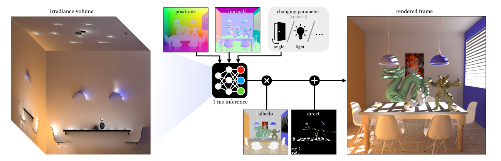

---

## 1. 引言（Introduction）

在静态场景中渲染移动物体是实时应用中的常见需求，其中角色和动画实体与预定义环境交互。然而，由于间接光照的**非局部性**和**计算昂贵**的特性，以高帧率计算全局光照仍然具有挑战性。

实践中一种常见的解决方案是将静态场景的光照"烘焙"（bake）到一个**光照探针网格**（light probe grid）中，形成一个辐照度体，可在运行时高效查询以对未见过（unseen）的物体进行着色。基于探针的辐照度体长期以来一直是电子游戏中全局光照的事实标准，因其简单性和运行时效率而备受青睐。虽然它们在物理上并不精确，但就其渲染效果而言，对所有实际实时应用来说都足够令人信服。然而，基于探针的方法并非没有局限：探针的放置和密度通常必须使用**场景特定的启发式规则**来确定，而且探针之间的插值可能引入明显的伪影。此外，由于这种表示本质上是低频的，探针难以捕获精细细节，如接触阴影（contact shadows）或微妙的辐照度变化。要实现高频光照效果，需要显著提高探针网格的密度，但由于其三次方缩放特性，这会迅速变得难以处理。

除了经典探针方法之外，最近的神经方法也展示了神经模型如何通过缓存表面上的辐射量来加速渲染 [HCZ21, RWG\*13, CDD\*24, SDR\*24, DPD22]。虽然这些方法实现了令人印象深刻的保真度，但它们通常不适合涉及训练期间未见过的动态对象的实时应用，因为预计算只考虑了已知的场景表面。类似地，神经缓存已被用于通过在线学习来摊销实时路径追踪的成本 [MRNK21]，但对去噪和光线追踪等昂贵步骤的依赖使它们在实时应用的严格运行时预算下不切实际。然而，随着对神经运算的支持日益普及且性能日益强大，用神经解决方案重新定义实时渲染问题，使它们能够受益于张量硬件性能的加速。在这项工作中，我们提出了**神经辐照度体**（NIV），它通过利用最新的神经进展来发展辐照度体的概念，以低内存为动态物体和静态表面提供高质量、实时的间接漫反射光照。NIV 的灵感来源于辐照度体方面的基础工作 [GSHG98]，采用了实际应用中常见的假设 [BB\*17, SSS\*20]。即，场景在运行时主要被视为静态的，而动态元素（如角色或交互实体）相对较小，不会显著影响全局光传播。

我们的方法保留了经典探针的许多运行时优势，同时实现了神经方法的卓越着色质量和内存使用。与基于探针的方法不同，我们的方法**无需启发式规则**，而是依赖反向传播直接优化重建质量。我们通过将辐照度场编码到一个紧凑的神经模型中来应对辐照度体的三次方缩放问题，在不牺牲高频细节的情况下实现更强的压缩。与神经方法不同，我们计算的是一个**预积分**且**体积化**的量，这使得无需光线追踪或去噪即可对动态物体进行无噪声着色。

我们的贡献如下：

- 一种**预计算方案**，能够烘焙路径追踪质量的辐照度，且无需逐场景的启发式规则，并能对未见过的移动物体进行着色。
- 与最先进的神经渲染方法相比，**渲染成本降低一个数量级**。
- 一种辐照度场的**紧凑表示**，在固定内存预算下，质量比竞争的实时体积方法提升一个数量级。
- **扩展到非静态辐照度场**的能力，这是一种常见应用，例如昼夜循环（time-of-day cycle）。

---

## 2. 相关工作（Related Work）

**传统预计算（Traditional Precomputation）。** 在实时中计算任意场景渲染方程 [Kaj86] 的无噪声解仍然不可行。因此，渲染研究长期以来依赖于预处理技术，即"烘焙"，以消除运行时这部分计算。由于直接光照的计算相对廉价，许多方法专注于预计算（漫反射）光传输中更复杂的间接分量。

我们的工作从辐照度探针体积 [GSHG98] 中汲取了重要灵感，与其有着相同的目标：体积化地预计算辐照度，以在运行时实现移动物体高效且稳定的着色。大量后续工作改进了基于探针的辐照度缓存，专注于探针放置和插值的挑战，以缓解漏光伪影（light-leaking artifacts）和重建误差。解决方案包括使用几何项 [ST15]、法线偏移 [Hoo16]、非均匀探针放置 [WKKN19, ZWZ\*25] 以及压缩 [VPG14, ZLZ\*25] 等启发式规则。诸如可见性信息 [IS17, MMNL17] 和预计算辐射传输 [SKS02] 等增强功能通过使用遮挡信息进一步提高了着色精度，而对光泽材质 [RLP\*20] 的扩展扩大了适用性。与基于探针的技术不同，我们的方法**连续地**表示辐照度，免除了探针插值和放置的问题。

**使用神经网络的预计算（Precomputation using Neural Networks）。** 神经网络已被广泛研究用于逼近辐射度，应用范围从静态场景 [HCZ21] 到涉及动态参数（如场景照明 [RWG\*13, RBRD22]）、各种场景配置 [SDR\*24, DPD22] 或一组场景参数内的流形 [CDD\*24] 的场景。在架构方面，最近探索了更先进的神经表示，例如基于 transformer 架构的表示 [RHP\*24, ZDP\*25]。上述所有神经方法的一个关键优势是它们能够**隐式**学习表示，无需传统预计算方法所需的问题特定启发式规则。神经技术通常比经典方法提供更高质量，但代价是更长的预计算时间和更高的推理成本。最近，有人尝试将神经预计算与传统预计算结合起来 [ISSS24]，为每个探针配备一个计算插值所用权重函数的小型神经网络。然而，与我们的方法相比，探针放置仍然需要手动完成，需要场景特定的启发式规则和/或艺术家输入来定义预计算体积及其空间变化的密度。

**在线缓存自适应（Online Cache Adaptation）。** 预计算渲染方程部分内容的技术难以应对完全动态的效果，因为场景参数的变化需要一次新的预计算过程来捕获更新后的全局光照。为了解决这个问题，开发了在运行时更新缓存量的方法 [MGNM19, MRNK21]，将传统的预计算概念转化为在线概念。然而，为支持频繁的运行时更新，这些方法依赖较小的缓存来维持效率，这削弱了它们的表示能力。神经辐射度缓存（Neural Radiance Caching）[MRNK21] 通过追踪额外的光线来延迟缓存查询——这减少了偏差但增加了采样方差——从而缓解了这一问题，但需要额外的去噪。虽然在线缓存自适应提供了对任意场景变化的鲁棒性，但我们的工作聚焦于一个**不允许**追踪光线或去噪额外成本的环境。

---

## 3. 预备知识（Preliminaries）

通过从渲染方程 [Kaj86] 中排除与视角相关的光照效果并只关注漫反射光照，双向反射分布函数（BRDF）可以从反射辐射度积分中分解出来。这一简化将公式化归结为辐照度函数 $E$：

$$E(x,n) = \int_\Omega L_i(x,\omega_i) \langle \omega_i, n \rangle^{+}\, \mathrm{d}\omega_i \tag{1}$$

在位置 $x$ 处，项 $n$ 可以表示球面域内的任何方向，其中 $E(x,\cdot)$ 定义了一个连续的球面函数。请注意，辐照度也定义在非表面位置上。由于漫反射 BRDF 是一个与表面反照率 $\rho(x)$ 成正比的常数，漫反射反射辐射度 $L_r(x)$ 可以简化为：

$$L_r(x) = \frac{\rho(x)}{\pi} \cdot E(x,n) \tag{2}$$

为简单起见，我们将间接辐照度记为 $E$，直接光照 $D$ 在运行时相加。图 3 展示了这些量。

---

## 4. 神经辐照度体（Neural Irradiance Volume）

我们的目标是在已知的静态环境中，使用一种高效且紧凑、无需逐场景启发式规则即可预计算的表示，来渲染训练期间未见过的动态物体。我们通过学习一个神经间接辐照度函数 $E_\theta$（称之为**神经辐照度体**，NIV）来实现这一目标。给定一个场景，我们通过以损失驱动的优化训练 $E_\theta$，在场景域内密集采样的位置-方向对 $(x,n)$ 上，对路径追踪的间接辐照度值 $E(x,n)$ 进行回归。在运行时，NIV 支持引入未见过的物体，为动态物体和静态表面推断高质量漫反射光照，在消费级硬件上以全高清帧每帧运行约一毫秒。

### 4.1. 紧凑辐照度表示（Compact Irradiance Representation）

我们的方法解决了传统辐照度体 [GSHG98, MGNM19] 的固有效率问题，这些辐照度体通常以固定的网格分辨率密集预计算。这可能是浪费的，因为很大一部分表示容量可能被分配到场景几何内部，或辐照度信号变化极小的区域。为克服这些局限，我们利用两个组件：一个小型神经网络和一个多级哈希编码 [MESK22]。

**神经网络（Neural Network）。** 我们的模型使用一个四层全连接的基于坐标的神经网络 [MRNK21]，除最后一层外在所有层应用 ReLU 激活函数，将输入的位置和方向映射为辐照度值。我们训练了各种不同总体内存容量（memory capacity）的神经网络（参见表 1）。较小的模型对输入位置 $x$ 添加频率编码 [MST\*21]，以缓解神经网络在回归高频信号时的困难 [TSM\*20]。较大的模型使用本节后面讨论的**学习式输入编码**（learned input encoding）。

与经典方法相比，一个显著的区别在于我们如何组织辐照度缓存。经典的基于探针的方法将每个位置 $x$ 映射到一个球面调和函数（spherical harmonics function），然后对给定方向 $\omega$ 求值以返回辐照度 $E$，可紧凑地描述为 $x \mapsto (\omega \mapsto E)$。而我们的模型将 5D 输入直接映射到输出，即 $(x,\omega) \mapsto E$。这种更简单的重新表述使得第 4.2 节和第 6 节中描述的强大扩展成为可能，并且不需要像球面调和那样选择一组基函数。

**学习式编码（Learned Encodings）。** 为了在不使用更昂贵神经网络的情况下捕获更大场景的辐照度场，我们将较大容量模型的频率编码替换为学习式多级哈希网格编码 [MESK22]。这种编码将 3D 空间中的位置以多个分辨率映射到潜在向量（latent vectors），其中更精细级别的潜在向量存储在哈希表中。这允许对空间的自适应使用，但也会导致输入冲突，因为许多位置可能被映射到哈希表中相同的潜在向量。正如先前工作 [MESK22] 所示，这些冲突在优化过程中被隐式处理，因为更重要样本的梯度在平均梯度中占主导地位，从而实现了压缩表示。这防止了不重要的区域消耗表示容量，而在基于网格的方法中，几何内部的样本仍会占用内存。另一方面，过多的冲突会导致重建质量下降。因此，我们控制哈希表的大小，以实现对于我们表示辐照度信号这一特定用例最优的冲突率，从而同时促进表示的紧凑性和重建质量。我们的评估表明，高冲突率只会轻微影响辐照度重建，同时会大幅降低所需的内存容量，见图 4。在我们所有实验中，NIV 的哈希表大小参数为 $T = 2^{17}$，这在我们测试的所有场景上都兼顾了内存使用和表示质量。多级哈希编码的其他参数如下：潜在维度大小为 4，各级之间的缩放因子为 $\sqrt{2}$，最粗级别的一边大小为 16，级别数量根据目标容量在 2 到 8 之间变化（见表 1）。

**图 4. 在 Sponza 上改变哈希表大小（8 级编码）对 NIV 重建误差的影响。** 允许哈希冲突对 MSE 的影响轻微，同时显著减少所需内存。

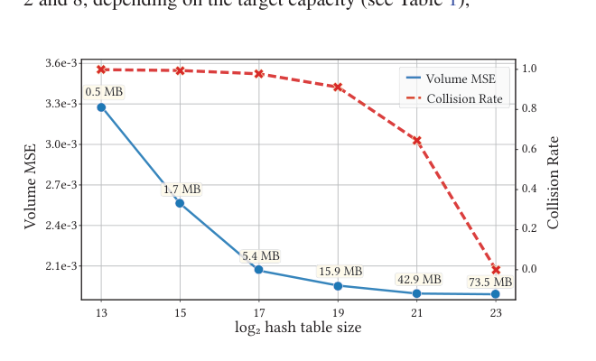

### 4.2. 统一的体积与表面缓存（Unified Volume and Surface Cache）

辐照度探针之所以是实用的解决方案，是因为它们提供了一种统一的表示，可以同时渲染动态和静态表面 [BB\*17]。然而，在实践中，通常还需要额外的表示，因为探针本身容易丢失接触细节，并且无法在静态表面上提供足够高的质量。这种额外表示通常以专用于静态表面的 2D 缓存形式出现，如光照贴图（light maps）[A\*86]，它可以被预计算以提供更高质量，但代价是内存利用率高、由于光照贴图和辐照度探针代码路径之间的分支导致的执行发散，以及 UV 参数化问题。

NIV 提供了这两种方法的优势——表面上的高质量和对未见过的动态物体的支持——因为它固有地在更广泛的 5D 场中捕获了静态表面的高质量 2D 表示。我们实现这一点无需修改模型架构，而只需调整训练过程（第 4.5 节）：我们对一部分位置在场景表面进行**显式采样**，其方向确定性地对齐到相应的表面法线。这个表面域构成了整个 5D 域的一个小 2D 流形，根据我们的实验，它只消耗整个模型可忽略的容量。我们通过实验验证，将 20% 的训练样本分配给静态表面，可以在体积和表面辐照度重建之间取得良好平衡。这种有针对性的调整显著提高了渲染质量，有效捕获了接触阴影等高频细节，同时不损害动态物体的质量，如图 6 中 Sponza 场景中横幅的伪彩色可视化所示。值得注意的是，这种低维的专用表示使用基于网格的缓存来建模是不可行的，因为网格难以在无显著内存开销或诉诸具有自身缺陷的独立 2D 结构的情况下，将分辨率自适应到任意表面流形。

### 4.3. 学习预积分辐射度（Learning Pre-integrated Radiance）

神经渲染技术学习的是场景表面上的一个辐射量，它可以是出射 [MRNK21, DPD22, HCZ21, CDD\*24] 或入射 [DKHD25] 辐射度。与此不同，我们的方法为场景体积中的每个位置和法线对学习一个**体积辐射量**，即辐照度 $E$。由于我们有意识地定制方法来为漫反射材质着色，我们分解出 BRDF，只学习积分的入射辐射度。使用和学习一个**预积分**且**方向平滑**的信号使我们的方法具有两个重要特性：我们**不需要运行时采样**，并且**简化了学习任务**。

**采样方差（Sampling Variance）。** 使用学习的入射辐射度 $L_i^\theta$（即未预积分）的神经表示进行渲染在计算上是昂贵的。具体来说，在运行时，$\int L_i^\theta(x,\omega_i)\langle\omega_i,n\rangle^{+}\mathrm{d}\omega_i$ 需要数值计算，这需要多个样本，以免方差主导整体误差。为了获得高质量结果，每个着色点要么需要多次网络求值，要么需要更少的求值但附加去噪。

**表示简洁性（Representational Simplicity）。** 学习辐照度而非入射辐射度是更实用的选择，因为辐照度固有地更平滑且更易于表示。我们通过将 NIV 学习的量替换为 $L_i$，同时保持相同的训练预算来验证这一论断。我们在补充材料中通过实验验证，学习这种表示需要更长的收敛时间，并显著增加运行时成本。

**表 1. 使用 RTX 4090 和 i9-13900K，在 4 层网络 [MRNK21] 驱动神经辐照度体于全高清（1920×1080）帧上的推理时间。** 无网格编码（-）的网络使用八波段位置编码 [MST\*21]。"half"渲染四分之一分辨率，"full"为全高清。所有参数均为半精度。

| 宽度 | 网格级别 | full (ms) | half (ms) | 内存 (MB) |
|---|---|---|---|---|
| 16 | - | 0.19 | 0.029 | 0.003 |
| 32 | - | 0.20 | 0.031 | 0.01 |
| 64 | - | 0.25 | 0.069 | 0.03 |
| 64 | 2 | 0.31 | 0.088 | 0.16 |
| 64 | 4 | 0.67 | 0.18 | 1.20 |
| 64 | 6 | 1.06 | 0.26 | 3.30 |
| 64 | 8 | 1.35 | 0.37 | 5.40 |

### 4.4. 渲染（Rendering）

训练之后，NIV 可以实时渲染帧，其管线与经典辐照度探针非常相似。从渲染场景的 G 缓冲区开始，位置和法线缓冲区被输入神经模型，该模型在单个批次中逐像素推断 $E(x,n)$。使用公式 (2) 获得间接漫反射辐射度，再加上表面自发光和直接光照得到最终帧，如图 1 所示。

**半分辨率渲染（Half-resolution Rendering）。** 我们的方法可以在降低的分辨率下运行以获得更高性能，同时仍使用全尺寸的反照率缓冲区 $\rho$ 来保证材质准确。以半分辨率运行显著减少了每帧的计算时间，对于我们最大的模型只需 0.37 ms，半分辨率运行时概览参见表 1。半分辨率渲染是实时渲染中的常见做法，但会引入走样伪影，可以通过使用行业实践中常见的上采样方法 [KCLU07] 部分解决。由于间接辐照度在屏幕空间中平滑变化，走样仅略微可察觉，尤其是在与全分辨率反照率缓冲区相乘之后（见补充视频）。

**动态环境光遮蔽（Dynamic Ambient Occlusion）。** 预计算的辐照度场（无论是缓存的探针还是 NIV）无法捕获动态物体如何影响间接光照，但在实践中这通常无关紧要，因为新增的几何体预计与场景相比尺寸较小。一些重要的效果仍可能被遗漏，例如动态物体上的自遮挡以及它们投射到场景上的间接遮挡。减轻部分这些遗漏交互的常见解决方案是应用环境光遮蔽通道 [SA07]。由于 NIV 已经捕获了静态表面上的局部高频效果（如第 4.2 节所述），我们运行一个较轻量的动态环境光遮蔽通道，其中在计算着色点的半球遮挡时仅考虑动态几何体。这在动态物体着色时模拟自遮挡，并且在静态表面上模拟新几何体的存在如何部分遮挡间接辐照度。

**图 5. 剔除场景几何内部的训练数据并将部分训练预算分配给场景表面采样，两者都能提高重建质量。** 结合这些策略能产生最鲁棒的结果。

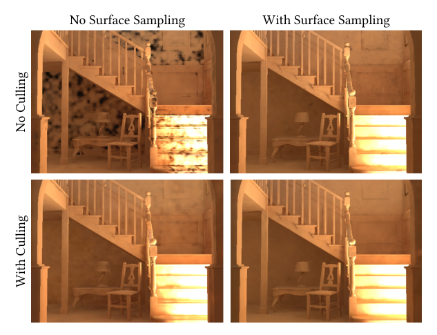

### 4.5. 训练（Training）

NIV 通过在场景体积中均匀采样位置-方向对 $(x,n)$ 来训练——其中 20% 在表面几何上均匀采样，其方向 $n$ 设为表面法线——并通过路径追踪计算相应的真值间接辐照度 $E(x,n)$。请注意，虽然训练时支持任何类型的发射体，但实时渲染需要能够被高效采样的光源，以避免采样噪声。

然后使用模型当前的输出 $E_\theta$ 来计算**相对 L2 损失**，将 MSE 通过网络预测的平方进行归一化 [Leh18]：

$$\mathcal{L}_\theta(E(x,n), E_\theta(x,n)) = \frac{(E_\theta(x,n) - E(x,n))^2}{\text{sg}(E_\theta(x,n)^2) + \epsilon} \tag{3}$$

其中 `sg` 表示停止梯度（stop gradient）运算，常数 $\epsilon = 0.01$。在训练过程中，我们丢弃表面内部的样本，这通过检查在估算辐照度时首次命中处的大多数法线是否为背向（backfacing）法线来识别。这避免了在运行时不可见的输入上浪费容量，同时也防止了静态表面附近出现轻微的暗色漏光。我们在图 5 中展示了将 20% 的训练数据采样到表面以及剔除背向法线样本的影响。

我们使用 PyTorch [PGC\*17] 作为训练框架，使用 Mitsuba3 [JSR\*22] 作为真值数据的渲染器，并使用 Adam [Kin14] 优化模型参数，学习率为 $10^{-2}$，批大小为 $2^{16}$。在前 10k 次迭代之后，我们通过指数衰减将学习率降低到 $10^{-4}$，与其他神经渲染工作类似 [HCZ21]。我们测试的所有场景最多在 50k 次迭代后收敛。在单个 RTX 4090 上，像 Cornell Box 这样的简单场景大约需要五分钟收敛，而像 Sponza 这样的中等规模场景则需要三十分钟。值得注意的是，这些时间的大部分用于路径追踪辐照度（例如 Cornell Box 上占计算预算的 94%），而非优化模型参数。

---

## 5. 结果（Results）

由于我们的方法与基于探针的全局光照方法、神经表面缓存以及可变场景的神经渲染相关，我们将详细比较这三类方法。

### 5.1. 基于探针的方法（Probe-based Methods）

我们将 NIV 与一个现代的探针网格进行比较，该网格类似于 DDGI [MGNM19]，在我们的渲染系统中实现以确保与真值路径追踪的兼容性。实现细节见补充材料。在我们的实验中，我们遵循 DDGI 的实现，但使用光线追踪而非深度纹理来计算可见性 [MGNM19, MMNL17]。这一选择在我们以质量为重点的比较中有利于基于探针的 DDGI 基线，因为光线追踪的可见性消除了深度纹理的走样，并避免了额外的内存开销——否则 DDGI 每个探针需要 1168 字节，其中 1024 字节专用于深度缓冲区。

我们的探针基线使用二阶球面调和（9 个系数）[RH01]，以半精度存储，每个探针 54 字节。虽然可以进一步将探针量化到每探针 28 字节 [RSS\*24]，但即使压缩是无损的，2 倍因子对呈现的结果也影响甚微。为完整起见，我们还在补充材料中与开源行业实现 DDGI [NVI25] 进行了比较。

**内存-误差权衡（Memory-Error Trade-off）。** 我们在场景体积中随机采样的点-方向对上评估 MSE，因为它是衡量为未见过移动物体着色的质量的良好指标。在所有测试场景中，NIV 在给定的内存预算下将质量提升了约一个数量级，与基于探针的方法相比，尤其是在较低的表示容量下。Sponza 上的定量和定性示例见图 6。虽然光线追踪可见性降低了基于探针技术的 MSE，但它仍然无法缩小与 NIV 的差距，并且带来了显著的运行时成本。

探针网格较差的内存缩放特性并不令人意外，因为辐照度体随空间离散化三次方缩放，且缺乏在最需要的地方自适应分配容量的能力。相比之下，NIV 没有这样的约束，可以基于损失函数隐式分配容量。辐照度体的这种局限以两种明显的方式显现：完全无法捕获接触阴影，以及在不使用光线追踪可见性时出现漏光，见图 6。接触阴影的准确性和漏光防护对现实世界的应用都至关重要，而神经表示会自动处理这两者。其他场景的额外定量数据可在补充材料中找到。

**性能（Performance）。** 查询规则探针网格的效率极具竞争力，因为它仅由对少量球面调和系数的简单三线性插值组成。实际运行时成本取决于网格大小以及系数在内存中的布局方式，这会影响内存传输和缓存行为。由于我们的模型使用哈希函数在网格坐标和潜在向量之间映射，如果两者都进行了相应的优化，简单的基于探针的方法应该始终在性能上略胜 NIV。此外，NIV 需要评估输入编码并执行矩阵乘法进行网络评估 [MRNK21]，在 RTX 4090 上合计产生约 1 ms 的成本。如表 1 所示，NIV 在全高清分辨率下最少需要 0.19 ms，半分辨率渲染时则需要 0.029 ms。依赖多分辨率哈希网格会增加运行时成本，这表明内存传输成本也主导了我们方法的性能。无论如何，依赖 2 或 4 级网格（0.16 至 1.20 MB）导致约 0.5 ms 的运行时，这对于实时应用来说足够快，并且与基于探针的方法相比提供了更好的质量。

### 5.2. 神经表面缓存（Neural Surface Cache）

依赖神经网络沿场景表面存储出射辐射度的方法 [RWG\*13, HCZ21, CDD\*24] 无法直接为不属于训练域的物体着色。当在场景中引入先前未见过的动态物体时，需要光线追踪将着色计算推迟到训练过的表面位置。虽然这种方法避免了引入额外偏差，但它增加了与推迟路径深度成正比的最终着色方差。以在线方式适应场景的缓存 [MRNK21] 提供了一种替代方案，通过持续更新其神经模型来考虑新引入的物体。然而，更新缓存以及推迟查询以缓解其（相对较小的）缓存的偏差，都需要在运行时进行光线追踪。

我们通过训练一个类似于神经辐射度缓存 [MRNK21] 的模型来与神经表面方法进行比较，该模型附加了一个与我们方法表示容量相同的多分辨率哈希编码 [MESK22]。训练后，该模型捕获静态场景中任意点的出射辐射度，但不包括动态物体。通过将缓存查询推迟一个反弹（或更多，当推迟的反弹再次落在动态物体上时），神经表面缓存可以用于估计动态物体上的间接光照。为去除由此产生的方差，必须使用去噪器。光线追踪和去噪都会增加显著的运行时开销，每帧约 5-10 ms，即使使用硬件支持的光线追踪和高效的神经去噪也是如此，见图 8。

**结果（Results）。** 我们使用 NIV 和神经表面缓存渲染数据集中的场景，并评估相对于路径追踪参考的渲染误差。所有测试场景都包含覆盖输出图像 5% 到 10% 面积的动态物体，图 7 显示了这样一个动态物体的局部放大图。如表 2 所示，NIV 在相同内存预算下对所有输入都取得了更高质量的结果，并且由于不需要光线追踪和去噪，运行速度快了 5-10 ms。图 7 例证了 White room 场景中的偏差-方差权衡：神经表面缓存的大部分伪影来自高蒙特卡洛方差，因此去噪器（Optix）没有足够的信息来重建无伪影的帧。图 9 显示增加表面模型容量对质量几乎没有影响。由于方差是误差的主要来源，增加样本数是提高质量的更有效方式，但这会线性增加运行时成本。

**图 6. Sponza 场景中横幅的水平切片（5.4 MB 预算）。** NIV 比基于探针的方法更好地捕获了辐照度渗透和阴影。NIV 在整个场景体积中具有约 10 倍更高的质量。评估过程中对探针方向的光线追踪可见性（"+RT"）降低了整体误差，但增加了显著的性能开销。误差图突出显示了逐像素的绝对亮度误差。

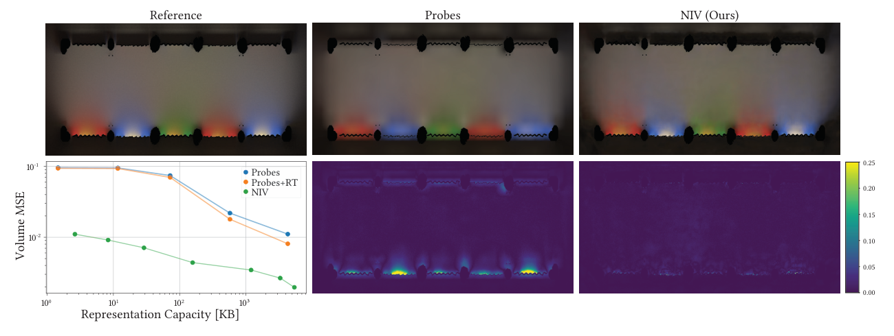

**图 7. 使用神经表面缓存渲染需要一次推迟的表面查询，这会引入噪声 (a)。** 像 Optix [PBD\*10] 这样的神经去噪器减少了噪声，但会产生斑点状伪影 (b, c)，只有通过更昂贵的路径追踪样本才能解决。我们的方法避免了路径追踪和去噪，同时显著提高了质量 (d)，与参考图像 (e) 相比。

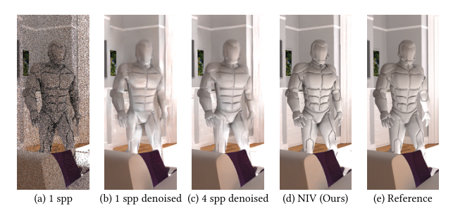

**图 8. NIV、去噪的神经表面缓存和去噪的路径追踪之间的运行时比较。** 各方法的光线采样预算选择为使渲染质量与 NIV 匹配。表面缓存只追踪单个反弹（4 spp），而路径追踪（16 spp）则追踪带俄罗斯轮盘赌（Russian Roulette）的完整路径。所有方法都通过光栅化通道提供主可见性，该通道不计入计时。

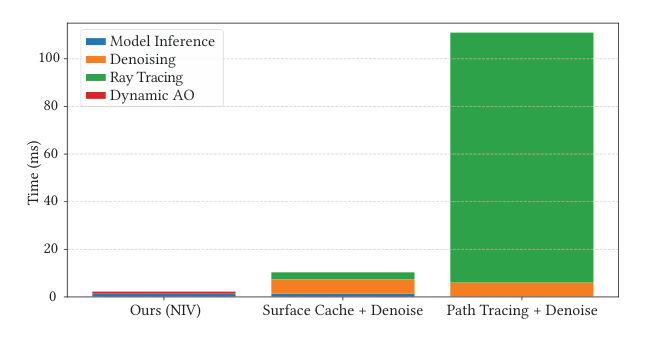

**表 2. 神经表面缓存与 NIV 之间的比较。** 来自我们数据集的场景在添加动态物体后进行渲染，并与路径追踪参考进行比较。两种方法都使用了 5.40 MB 的容量。我们使用 FLIP [ANSA21] 的 HDR 变体。

| 场景 | FLIP (↓) 表面 | FLIP (↓) 我们 | MSE (↓) 表面 | MSE (↓) 我们 |
|---|---|---|---|---|
| Sponza | 0.25 | 0.10 | 2.32e-3 | 9.09e-6 |
| Cornell box | 0.14 | 0.05 | 5.57e-4 | 2.53e-5 |
| Dining room | 0.27 | 0.24 | 3.07e-2 | 3.31e-3 |
| Bathroom | 0.15 | 0.06 | 3.22e+0 | 2.76e-3 |
| White room | 0.17 | 0.09 | 2.76e-3 | 8.13e-4 |
| Living room | 0.10 | 0.04 | 1.14e-2 | 2.36e-4 |

### 5.3. 可变场景的神经渲染（Neural Rendering of Variable Scenes）

虽然我们的目标是在不重新训练的情况下为移动物体着色，但其他方法在训练阶段显式地考虑场景变化。这些方法通常假设每个可变场景元素都有一个预定义的范围，该范围被编码到一个结构化表示中——通常是一个向量。该表示可以直接用作神经模型的输入 [DPD22]，或通过一个学习式编码处理 [SDR\*24]。这些策略试图学习所有可能的场景变量排列下的表面辐射场，与那些将学习限制在这些参数内单个流形上的技术 [CDD\*24] 形成对比。

**图 9. 神经表面缓存与我们方法在 Sponza 上相对于参考的渲染误差。** 由于神经表面缓存中的大部分误差来自推迟查询的方差，增加模型容量——从而减少其偏差——并不能提高整体质量。由于 NIV 不需要采样，其质量随分配的内存扩展。

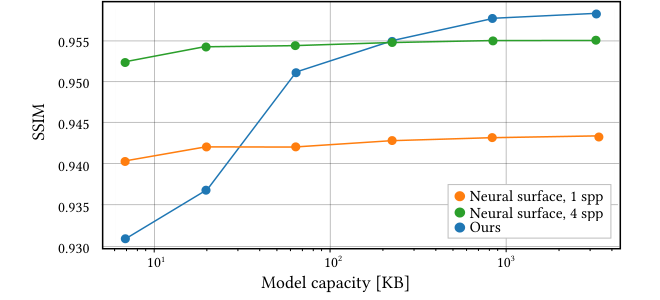

尽管这些方法正确建模了复杂可变场景交互引起的光传输，但与（神经）辐照度体相比，它们呈现出几个缺点。首先，每当场景参数集合发生变化时（例如添加、移除或修改物体），它们都需要重新训练。其次，它们无法实现实时性能，在我们的实验中推理时间超过 100 ms（见补充材料）。第三，推理时间随场景中动态物体的数量扩展，这限制了像动画网格这样具有许多场景变量的基元的使用。这些局限凸显了在实际应用中部署此类方法的挑战。然而，一个自然的问题是：当这些方法被类似地配置为只学习间接漫反射全局光照时，它们的渲染质量与 NIV 相比如何。

**图 10. 在 1 MB 模型容量下，NIV 捕获了从静态场景到可变场景元素（漂浮的犰狳 Armadillo）上的颜色渗透，而可变场景方法 [DPD22, SDR\*24] 则没有。** 与所比较的方法不同，NIV 在训练期间没有见过动态物体，并且可以在不重新训练的情况下以任意数量查询它们。定量数据见图 11。

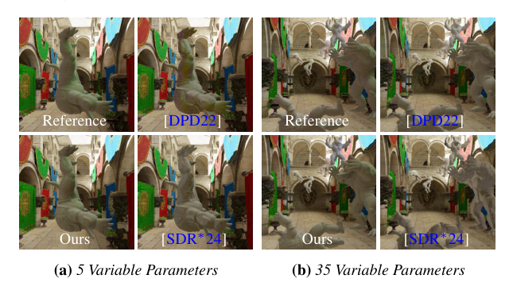

NIV 并没有显式建模动态物体与周围场景之间的高阶交互。相比之下，基于可变场景编码的方法需要将其部分表示容量用于在静态场景几何上学习出射辐射度之外，还要学习这些交互。在我们的结果中，我们发现对于固定模型大小，NIV 通常达到相当或更低的渲染误差，尤其是随着场景变量数量的增加。

**图 11. 我们将 NIV 与通过 PixelGenerator [DPD22] 或学习式编码 [SDR\*24] 编码变化的场景参数的可变场景方法进行比较。** 与这些需要为每种场景配置进行训练的方法不同，NIV 只在空场景的静态辐照度上训练一次。然而，在较高的物体数量下它实现了更低的渲染误差，这凸显了辐照度假设的有效性。所有方法使用相同的 1 MB 容量，每个物体增加五个自由度（最右侧数据点为 35 个场景变量）。

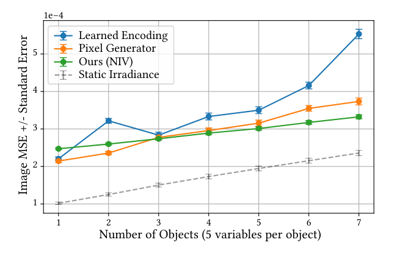

如图 10 和图 11 所示，NIV 实现的渲染误差与那些经过显式场景物体知识训练的方法处于同一范围内。这表明辐照度体公式与动态环境光遮蔽相结合，在泛化到未见配置方面非常有效。然而，在这种设置下辐照度体存在一个理论下界，在图 11 中以虚线表示。该下界对应于在不包含动态物体的情况下计算出的路径追踪静态辐照度场的误差水平。随着可变场景方法模型容量的增长，它们的渲染误差可以降到该阈值以下，从而能够产生更接近路径追踪全局光照的着色效果，包括可变参数与场景之间的高阶交互。在补充材料中，我们展示了一个与图 11 类似的额外图，其中可变场景方法使用各自工作中描述的建议模型容量运行 [DPD22, SDR\*24]，这以提高渲染质量为代价，但需要额外的模型容量和更慢的运行时。

---

## 6. 应用：更高维度的辐照度场（Application: Higher-dimensional Irradiance Fields）

在许多现实世界的应用中，运行时预计只有一组已知的场景参数会变化 [SSS\*20]，例如模拟昼夜循环的旋转发射体。鉴于这种行为的普遍性，我们通过向模型引入新的输入（例如移动发射体的当前位置），扩展了针对这种变化场景参数的神经辐照度体预计算。我们在随机采样可变场景参数的同时训练辐照度场，与第 5.3 节中的神经可变场景方法类似。训练之后，这消除了实时更新表示的需要，并避免了潜在的时间伪影和更新成本。

如前所述，使用许多可变参数进行训练会显著影响神经表示的性能。为保持性能，我们针对学习 1-2 个在实际中有用的动态现象变量。我们发现对这类变化应用频率编码 [MST\*21] 就足够了，它只增加很少的推理开销。在相同的表示容量下扩展到两个以上的场景变量会导致可见的重建误差，这可以通过使用学习式编码来解决，但具有第 5.3 节所示的相同缺点。我们实现了两个用例：模拟昼夜循环的旋转方向光源，以及场景中移动的遮挡物体。结果见图 12 和补充视频。为确保无伪影的结果，我们为此应用将编码场景位置的哈希表大小加倍（约 10 MB）。

**图 12. 将方向光的角度加入 NIV，使我们能够在 Sponza 中建模昼夜变化——这是游戏开发中的常见用例——而无需在运行时进行进一步训练。** Bunny 在训练中未见，但接收到了来自场景的高质量颜色渗透。

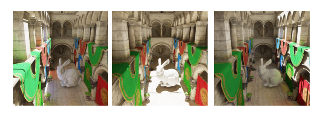

---

## 7. 局限性与未来工作（Limitations & Future Work）

**直接光照（Direct Illumination）。** NIV 的一个基本假设是直接光照可以在运行时高效估计而不引入与采样相关的噪声。然而，这一假设只对简单光照和少量光源成立，可能需要额外的渲染通道，例如阴影贴图 [Wil78]。虽然存在许多处理多光源问题的实时技术 [BWP\*20]，但它们本身往往表现出显著的噪声水平，因此高效的无噪声着色是不可能的。

**辐照度体假设（Irradiance Volume Assumptions）。** 传统的基于探针的光照假设移动物体对场景光传输的影响很小——或者由艺术家控制 [SSS\*20]——这对许多现实应用成立，并且不妨碍其在游戏中的广泛使用 [BB\*17]。我们继承了这一假设，不捕获移动物体对场景光传输的影响。与基于探针的光照一样，对于光泽材质 [RLP\*20] 或高阶自遮挡 [SKS02] 需要扩展。

**压缩（Compression）。** 进一步压缩多级哈希编码和 MLP 架构是一个活跃的研究课题 [TMND\*23]。利用这类压缩可能进一步改善 NIV 的内存-误差权衡和运行时成本。值得注意的是，这类压缩可能引入伪影，可能需要问题特定的正则化项或训练参数调整 [DMD\*23]。我们的早期实验表明，使用强 Laplacian 正则化器和较低的学习率显著有助于重建。

**光泽材质（Glossy materials）。** NIV 可以通过将查询推迟到漫反射交点来用于非漫反射材质，代价是与采样相关的噪声。为保持无噪声渲染，可以探索替代方案。一个有前景的方向是将表面粗糙度作为控制参数纳入神经模型 [VHM\*22]，这可能使方法能够原生处理光泽材质。

**在线学习（Online Learning）。** 已经证明在运行时更新学习式缓存对于基于表面的表示是可行的 [MRNK21]。用在线学习扩展 NIV 是可行的，但由于其输入域更大（场景体积，而非场景表面的子集），学习固有地更慢，并且需要低偏差表示，因为它避免将查询推迟到其他场景位置。我们通过实验验证，从已学习的 NIV 开始比从头学习显著改善收敛。然而，要实时更新它，需要进一步的扩展，例如仅对相机的视锥进行采样和/或采用损失驱动的采样 [DPD22]。

**更大场景（Larger Scenes）。** 当将 NIV 扩展到更大场景时，我们发现模型容量最终成为限制因素，导致重建误差增加。一种解决方式是将场景划分为较小区域的网格 [RPLG21]，为每个区域学习一个不同的 NIV，这允许方法通过分配表示容量来保持精度。一个有趣的未来工作方向是在传统空间细分与神经网络容量之间取得平衡，正如相关工作所探索的 [WRM\*24]。另一个有前景的途径是集成层次细节（level-of-detail）技术，根据相机位置自适应地分配容量或选择低频模型。

---

## 8. 结论（Conclusion）

我们引入了**神经辐照度体**（NIV），一种现代化实时全局光照以支持动态物体的新方法。通过将间接辐照度场压缩到一个紧凑的神经模型中，NIV 克服了传统基于探针方法的局限，提供了卓越的视觉质量和内存效率上一个数量级的提升。我们的技术提供了一种统一、无噪声且高质量的解决方案，对实时应用切实可行。通过消除神经渲染技术中常见的昂贵运行时操作（如光线追踪或去噪）的需求，NIV 表明高质量间接光照可以在不牺牲性能的情况下实现。我们相信 NIV 有潜力通过降低内存需求和复杂度、提升视觉质量，使现有使用辐照度体的应用（如游戏引擎）受益。此外，其可微性使其成为逆向渲染管线和其他神经场景表示的有前景的构建模块。

---

**图 13. 使用我们的神经辐照度体的间接辐照度概述（为清晰起见不含反照率）。** 可移动物体 Lucy、Bunny 和 Dragon 在渲染时被放置到场景中，且在训练中未见。由于 NIV 和探针体积只捕获已知场景的间接辐照度，因此还按照第 4.4 节的描述添加了动态环境光遮蔽。所有插图中都可以与高样本数的路径追踪参考进行比较。与 NIV 相比，探针网格明显在处理几种漏光和错误的颜色渗透方面存在困难。

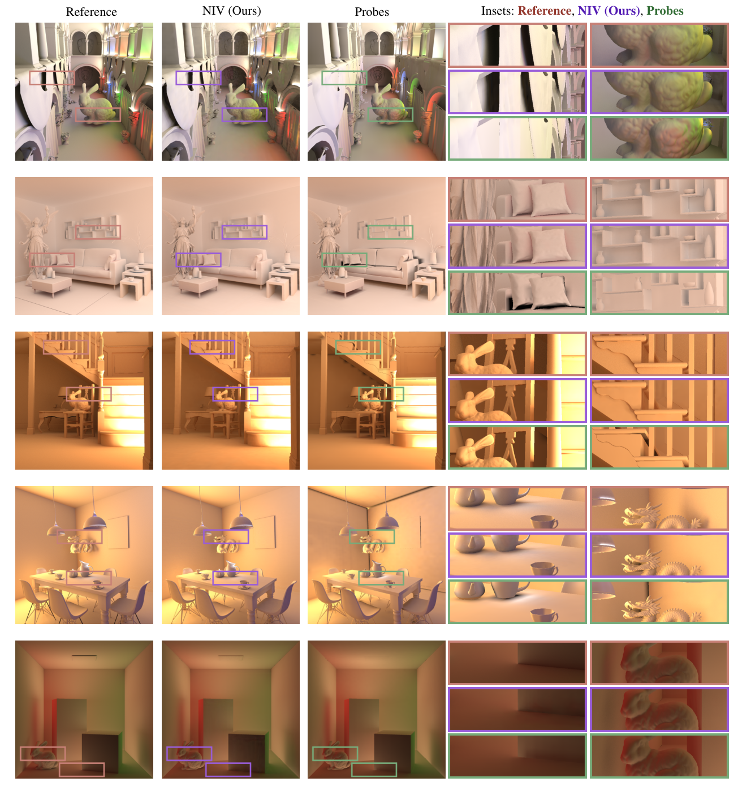

---

## 参考文献（References）

[A\*86] ARVO J., ET AL.: Backward ray tracing. In *Developments in Ray Tracing, Computer Graphics, Proc. of ACM SIGGRAPH 86 Course Notes* (1986), pp. 259–263.

[ANSA21] ANDERSSON P., NILSSON J., SHIRLEY P., AKENINE-MÖLLER T.: Visualizing Errors in Rendered High Dynamic Range Images. In *Eurographics Short Papers* (May 2021).

[BB\*17] BARRÉ-BRISEBOIS C., ET AL.: A certain slant of light: Past, present and future challenges of global illumination in games. *ACM SIGGRAPH Courses* (2017).

[BWP\*20] BITTERLI B., WYMAN C., PHARR M., SHIRLEY P., LEFOHN A., JAROSZ W.: Spatiotemporal reservoir resampling for real-time ray tracing with dynamic direct lighting. *ACM Transactions on Graphics (TOG) 39, 4* (2020), 148–1.

[CDD\*24] COOMANS A., DOMINICI E. A., DÖRING C., MUELLER J. H., HLADKY J., STEINBERGER M.: Real-time neural rendering of dynamic light fields. *Computer Graphics Forum 43, 2* (2024), e15014.

[DKHD25] DEREVIANNYKH M., KLEPIKOV D., HANIKA J., DACHSBACHER C.: Neural two-level monte carlo real-time rendering. In *Computer Graphics Forum* (2025), Wiley Online Library, p. e70050.

[DMD\*23] DATTA S., MARSHALL C., DONG Z., LI Z., NOWROUZEZAHRAI D.: Efficient graphics representation with differentiable indirection. In *SIGGRAPH Asia 2023 Conference Papers* (2023), pp. 1–10.

[DPD22] DIOLATZIS S., PHILIP J., DRETTAKIS G.: Active exploration for neural global illumination of variable scenes. *ACM Transactions on Graphics (TOG) 41, 5* (2022), 1–18.

[GSHG98] GREGER G., SHIRLEY P., HUBBARD P. M., GREENBERG D. P.: The irradiance volume. *IEEE Computer Graphics and Applications 18, 2* (1998), 32–43.

[HCZ21] HADADAN S., CHEN S., ZWICKER M.: Neural radiosity. *ACM Transactions on Graphics (TOG) 40, 6* (2021), 1–11.

[Hoo16] HOOKER J. T.: Volumetric global illumination at treyarch. *ACM SIGGRAPH Advances in Real-Time Rendering Course* (2016).

[IS17] IWANICKI M., SLOAN P.-P.: Precomputed lighting in call of duty: Infinite warfare. *Advances in Real-Time Rendering, Part I (ACM SIGGRAPH 2017 Courses)*, Article 7a (2017).

[ISSS24] IWANICKI M., SLOAN P.-P., SILVENNOINEN A., SHIRLEY P.: Neural light grid: Modernizing irradiance volumes with machine learning. *ACM SIGGRAPH Advances in Real-Time Rendering in Games Course* (2024).

[JSR\*22] JAKOB W., SPEIERER S., ROUSSEL N., NIMIER-DAVID M., VICINI D., ZELTNER T., NICOLET B., CRESPO M., LEROY V., ZHANG Z.: Mitsuba 3 renderer, 2022. URL: https://mitsuba-renderer.org.

[Kaj86] KAJIYA J. T.: The rendering equation. In *Proceedings of the 13th annual conference on Computer graphics and interactive techniques* (1986), pp. 143–150.

[KCLU07] KOPF J., COHEN M. F., LISCHINSKI D., UYTTENDAELE M.: Joint bilateral upsampling. *ACM Transactions on Graphics (ToG) 26, 3* (2007), 96–es.

[Kin14] KINGMA D. P.: Adam: A method for stochastic optimization. *arXiv preprint arXiv:1412.6980* (2014).

[Leh18] LEHTINEN J.: Noise2noise: Learning image restoration without clean data. *arXiv preprint arXiv:1803.04189* (2018).

[MESK22] MÜLLER T., EVANS A., SCHIED C., KELLER A.: Instant neural graphics primitives with a multiresolution hash encoding. *ACM transactions on graphics (TOG) 41, 4* (2022), 1–15.

[MGNM19] MAJERCIK Z., GUERTIN J.-P., NOWROUZEZAHRAI D., MCGUIRE M.: Dynamic diffuse global illumination with ray-traced irradiance fields. *Journal of Computer Graphics Techniques 8, 2* (2019).

[MMNL17] MCGUIRE M., MARA M., NOWROUZEZAHRAI D., LUEBKE D.: Real-time global illumination using precomputed light field probes. In *Proceedings of the 21st ACM SIGGRAPH symposium on interactive 3D graphics and games* (2017), pp. 1–11.

[MRNK21] MÜLLER T., ROUSSELLE F., NOVÁK J., KELLER A.: Real-time neural radiance caching for path tracing. *ACM Transactions on Graphics (TOG) 40, 4* (2021), 1–16.

[MST\*21] MILDENHALL B., SRINIVASAN P. P., TANCIK M., BARRON J. T., RAMAMOORTHI R., NG R.: Nerf: Representing scenes as neural radiance fields for view synthesis. *Communications of the ACM 65, 1* (2021), 99–106.

[NVI25] NVIDIA GAMEWORKS: Rtxgi-ddgi. https://github.com/NVIDIAGameWorks/RTXGI-DDGI, 2025.

[PBD\*10] PARKER S. G., BIGLER J., DIETRICH A., FRIEDRICH H., HOBEROCK J., LUEBKE D., MCALLISTER D., MCGUIRE M., MORLEY K., ROBISON A., ET AL.: Optix: a general purpose ray tracing engine. *ACM transactions on graphics (tog) 29, 4* (2010), 1–13.

[PGC\*17] PASZKE A., GROSS S., CHINTALA S., CHANAN G., YANG E., DEVITO Z., LIN Z., DESMAISON A., ANTIGA L., LERER A.: Automatic differentiation in pytorch. In *NIPS-W* (2017).

[RBRD22] RAINER G., BOUSSEAU A., RITSCHEL T., DRETTAKIS G.: Neural precomputed radiance transfer. *Computer Graphics Forum 41, 2* (2022), 365–378.

[RH01] RAMAMOORTHI R., HANRAHAN P.: An efficient representation for irradiance environment maps. In *Proceedings of the 28th annual conference on Computer graphics and interactive techniques* (2001), pp. 497–500.

[RHP\*24] REN H., HUO Y., PENG Y., SHENG H., XUE W., HUANG H., LAN J., WANG R., BAO H.: Lightformer: Light-oriented global neural rendering in dynamic scene. *ACM Transactions on Graphics (TOG) 43, 4* (2024), 1–14.

[RLP\*20] RODRIGUEZ S., LEIMKÜHLER T., PRAKASH S., WYMAN C., SHIRLEY P., DRETTAKIS G.: Glossy probe reprojection for interactive global illumination. *ACM Transactions on Graphics (TOG) 39, 6* (2020), 1–16.

[RPLG21] REISER C., PENG S., LIAO Y., GEIGER A.: Kilonerf: Speeding up neural radiance fields with thousands of tiny mlps. In *Proceedings of the IEEE/CVF international conference on computer vision* (2021), pp. 14335–14345.

[RSS\*24] ROUGHTON T., SLOAN P.-P., SILVENNOINEN A., IWANICKI M., SHIRLEY P.: Zh3: Quadratic zonal harmonics. *Proceedings of the ACM on Computer Graphics and Interactive Techniques 7, 1* (2024), 1–15.

[RWG\*13] REN P., WANG J., GONG M., LIN S., TONG X., GUO B.: Global illumination with radiance regression functions. *ACM Transactions on Graphics (TOG) 32, 4* (2013), 130–1.

[SA07] SHANMUGAM P., ARIKAN O.: Hardware accelerated ambient occlusion techniques on gpus. In *Proceedings of the 2007 symposium on Interactive 3D graphics and games* (2007), pp. 73–80.

[SDR\*24] SU R., DONG H., REN J., JIN H., CHEN Y., WANG G., LI S.: Dynamic neural radiosity with multi-grid decomposition. In *SIGGRAPH Asia 2024 Conference Papers* (2024), pp. 1–12.

[SKS02] SLOAN P.-P., KAUTZ J., SNYDER J.: Precomputed radiance transfer for real-time rendering in dynamic, low-frequency lighting environments. *ACM Transactions on Graphics (TOG) 21, 3* (jul 2002), 527–536.

[SSS\*20] SEYB D., SLOAN P.-P., SILVENNOINEN A., IWANICKI M., JAROSZ W.: The design and evolution of the UberBake light baking system. *ACM Transactions on Graphics (Proceedings of SIGGRAPH) 39, 4* (July 2020).

[ST15] SILVENNOINEN A., TIMONEN V.: Multi-scale global illumination in quantum break. *ACM SIGGRAPH Advances in Real-Time Rendering Course* (2015).

[TMND\*23] TAKIKAWA T., MÜLLER T., NIMIER-DAVID M., EVANS A., FIDLER S., JACOBSON A., KELLER A.: Compact neural graphics primitives with learned hash probing. In *SIGGRAPH Asia 2023 Conference Papers* (2023), pp. 1–10.

[TSM\*20] TANCIK M., SRINIVASAN P., MILDENHALL B., FRIDOVICH-KEIL S., RAGHAVAN N., SINGHAL U., RAMAMOORTHI R., BARRON J., NG R.: Fourier features let networks learn high frequency functions in low dimensional domains. *Advances in neural information processing systems 33* (2020), 7537–7547.

[VHM\*22] VERBIN D., HEDMAN P., MILDENHALL B., ZICKLER T., BARRON J. T., SRINIVASAN P. P.: Ref-nerf: Structured view-dependent appearance for neural radiance fields. In *2022 IEEE/CVF Conference on Computer Vision and Pattern Recognition (CVPR)* (2022), IEEE, pp. 5481–5490.

[VPG14] VARDIS K., PAPAIOANNOU G., GKARAVELIS A.: Real-time radiance caching using chrominance compression. *Journal of Computer Graphics Techniques (JCGT) 3, 4* (December 2014), 111–131. URL: http://jcgt.org/published/0003/04/06/.

[Wil78] WILLIAMS L.: Casting curved shadows on curved surfaces. In *Proceedings of the 5th annual conference on Computer graphics and interactive techniques* (1978), pp. 270–274.

[WKKN19] WANG Y., KHIAT S., KRY P. G., NOWROUZEZAHRAI D.: Fast non-uniform radiance probe placement and tracing. In *Proceedings of the ACM SIGGRAPH Symposium on Interactive 3D Graphics and Games* (2019), I3D '19, ACM.

[WRM\*24] WEIER P., RATH A., MICHEL É., GEORGIEV I., SLUSALLEK P., BOUBEKEUR T.: N-bvh: Neural ray queries with bounding volume hierarchies. In *ACM SIGGRAPH 2024 Conference Papers* (2024), pp. 1–11.

[ZDP\*25] ZENG C., DONG Y., PEERS P., WU H., TONG X.: Renderformer: Transformer-based neural rendering of triangle meshes with global illumination. In *Proceedings of the Special Interest Group on Computer Graphics and Interactive Techniques Conference Conference Papers* (2025), pp. 1–11.

[ZLZ\*25] ZHOU Z., LI C., ZHANG Z., TANG M., LI Z., LUAN S., HUANG Z.: Gaussian compression for precomputed indirect illumination. In *Proceedings of the Special Interest Group on Computer Graphics and Interactive Techniques Conference Conference Papers* (2025), pp. 1–10.

[ZWZ\*25] ZHU J., WU Z., ZHANG Q., LIAO C., HUANG Z.: Wishgi: Lightweight static global illumination baking via spherical harmonics fitting. *ACM Transactions on Graphics (TOG) 44, 4* (2025), 1–12.